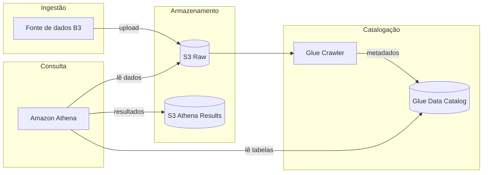

# Arquitetura

## Visão geral

O pipeline foi desenhado para ingerir dados brutos de ações da B3, catalogá-los automaticamente e permitir consultas SQL via Athena.



## Componentes

### Amazon S3 — Raw (`glue-b3-dev-s3-raw-303238378103`)

- **Função:** armazenar dados brutos (CSV, Parquet, JSON etc.) antes de qualquer transformação.
- **Versionamento:** habilitado — permite recuperar versões anteriores de objetos.
- **Acesso:** bloqueio total de acesso público.
- **Dev:** `force_destroy = true` para facilitar teardown.

Convenção sugerida de prefixos (próximas US):

```
s3://glue-b3-dev-s3-raw-303238378103/
├── stocks/          # cotações e histórico
├── fundamentals/    # dados fundamentalistas
└── landing/         # arquivos recém-chegados
```

### Amazon S3 — Athena Results (`glue-b3-dev-s3-athena-results-303238378103`)

- **Função:** destino dos resultados de queries do Athena (CSV por padrão).
- **Versionamento:** não habilitado (objetos efêmeros de consulta).
- **Acesso:** bloqueio total de acesso público.

### AWS Glue Crawler *(US-02 — planejado)*

- Varre o bucket raw e infere schema dos arquivos.
- Registra tabelas no Glue Data Catalog.

### AWS Glue Data Catalog *(US-02 — planejado)*

- Metadados centralizados (databases, tabelas, partições).
- Consumido pelo Athena para resolver queries.

### Amazon Athena *(US-03 — planejado)*

- Engine de consulta SQL serverless.
- Lê dados diretamente do S3 via Glue Catalog.
- Grava resultados no bucket athena-results.

## Governança e tags

Todos os recursos recebem tags via `default_tags` do provider AWS:

| Tag | Valor | Origem |
|-----|-------|--------|
| `Project` | `glue-b3` | `var.project_name` |
| `Environment` | `dev` | `var.environment` |
| `ManagedBy` | `terraform` | fixo |

Buckets recebem tag adicional `Name` com o nome completo do bucket.

## Nomenclatura de recursos

Padrão centralizado em `locals.tf`:

```
{project_name}-{environment}-{aws_service}-{purpose}[-{account_id}]
```

Exemplos (dev):

| Recurso | Nome |
|---------|------|
| Bucket raw | `glue-b3-dev-s3-raw-303238378103` |
| Bucket results | `glue-b3-dev-s3-athena-results-303238378103` |
| Glue Database *(US-02)* | `glue-b3-dev-glue-db-catalog` |
| Glue Crawler *(US-02)* | `glue-b3-dev-glue-crawler-raw` |
| Athena Workgroup *(US-03)* | `glue-b3-dev-athena-wg-primary` |

Detalhes completos: [Convenção de Nomenclatura](naming-convention.md).

## Decisões de design

| Decisão | Justificativa |
|---------|---------------|
| Sem módulos externos | Simplicidade e controle total no ambiente dev |
| `force_destroy = true` | Facilita destruição de buckets com objetos em dev |
| Conta no nome do bucket | Garante unicidade global e rastreabilidade |
| Provider `default_tags` | Tags consistentes sem repetir em cada recurso |
| Região `us-east-1` | Região padrão dev; Athena e Glue disponíveis |

## State do Terraform

Atualmente o state é **local** (`terraform.tfstate`). Para ambientes compartilhados, migrar para backend remoto (S3 + DynamoDB lock) será recomendado nas próximas entregas.
