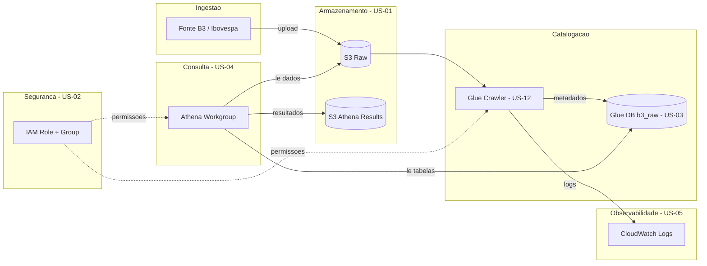

# Arquitetura

## Visão geral

Pipeline de dados para análise de ações da B3 (Ibovespa): ingestão no S3, catalogação via Glue e consultas SQL via Athena.

## Problema e valor

Tres problemas praticos (detalhes no [README](../README.md#o-que-este-projeto-resolve)):

1. **Acesso organizado** — S3 padronizado em vez de CSV local/Excel
2. **Catalogo automatico** — Glue Crawler registra `b3_raw.ibovespa`
3. **SQL sem banco gerenciado** — Athena paga por consulta, sem RDS/Redshift fixo

A query `SELECT ... FROM b3_raw.ibovespa WHERE ticker = 'PETR4' LIMIT 10` valida que a cadeia **S3 → Crawler → Athena** esta operacional antes de analises (MM7, MM30, regressao).

**Limites:** nao e trading, nao e tempo real, nao inclui dashboards; multi-dominio fica fora do escopo deste repo.



## Status de implementacao (Sprint 1)

| Componente | US | Status | Arquivo Terraform |
|------------|-----|--------|-------------------|
| S3 Raw | US-01 | ✅ | `main.tf` |
| S3 Athena Results | US-01 | ✅ | `main.tf` |
| IAM Role Crawler | US-02 | ✅ | `iam.tf` |
| IAM Policy + Group Athena | US-02 | ✅ | `iam.tf` |
| Glue Database `b3_raw` | US-03 | ✅ | `glue.tf` |
| Athena Workgroup | US-04 | ✅ | `athena.tf` |
| CloudWatch Log Group | US-05 | ✅ | `glue.tf` |
| Glue Crawler | US-12 | ✅ | `glue.tf` |

## Componentes

### Amazon S3 — Raw (`glue-b3-dev-s3-raw-303238378103`)

- Dados brutos (CSV, Parquet, JSON)
- Versionamento habilitado
- Acesso publico bloqueado
- `force_destroy = true` (dev)

Prefixos sugeridos:

```
s3://glue-b3-dev-s3-raw-303238378103/
├── stocks/
├── fundamentals/
└── landing/
```

### Amazon S3 — Athena Results (`glue-b3-dev-s3-athena-results-303238378103`)

- Saida das queries Athena em `query-results/`
- Criptografia SSE_S3 via Workgroup
- Sem versionamento

### IAM — Seguranca (US-02)

| Recurso | Nome | Funcao |
|---------|------|--------|
| Role | `glue-b3-dev-iam-glue-crawler` | Execucao do Glue Crawler |
| Policy | `glue-b3-dev-iam-athena-query` | Queries Athena (least privilege) |
| Group | `glue-b3-dev-iam-grp-athena-analysts` | Analysts (`usuario-dados`) |

Principio: **least privilege** — permissoes limitadas aos ARNs do projeto.

### Glue Data Catalog — Database `b3_raw` (US-03)

- Namespace logico para tabelas Ibovespa
- Configuravel via `glue_db_name` (default: `b3_raw`)
- Consumido pelo Athena para resolver schemas

### Amazon Athena Workgroup (US-04)

| Config | Valor |
|--------|-------|
| Nome | `glue-b3-workgroup` |
| Engine | Athena engine version 3 |
| Output | `s3://...-athena-results-.../query-results/` |
| Criptografia | SSE_S3 |
| Enforce config | `true` |

Engine v3 necessaria para window functions (MM7, MM30).

### CloudWatch Logs (US-05)

| Config | Valor |
|--------|-------|
| Log group | `/aws-glue/crawlers/glue-b3-crawler` |
| Retention | 14 dias |

Centraliza logs do Glue Crawler para debugging.

### AWS Glue Crawler *(Sprint 2 — pendente)*

- Varre bucket raw e infere schema
- Registra tabelas em `b3_raw`
- Role IAM e log group ja preparados

## Governanca e tags

Tags via `default_tags` do provider:

| Tag | Valor |
|-----|-------|
| `Project` | `glue-b3` |
| `Environment` | `dev` |
| `ManagedBy` | `terraform` |

## Nomenclatura

Padrao em `locals.tf`:

```
{project_name}-{environment}-{aws_service}-{purpose}[-{account_id}]
```

Excecoes logicas:

| Recurso | Nome | Motivo |
|---------|------|--------|
| Glue Database | `b3_raw` | Nome logico de negocio |
| Athena Workgroup | `glue-b3-workgroup` | Spec US-04 |
| Log Group | `/aws-glue/crawlers/glue-b3-crawler` | Padrao AWS |

Detalhes: [Convencao de Nomenclatura](naming-convention.md)

## Decisoes de design

| Decisao | Justificativa |
|---------|---------------|
| Sem modulos externos | Simplicidade em dev |
| `force_destroy = true` | Teardown facil |
| `default_tags` | Tags consistentes |
| Grupo IAM para analysts | Evita limite de 10 policies/user |
| Engine Athena v3 | Window functions MM7/MM30 |
| State local | Sprint 1; backend remoto recomendado para prod |

## Validacao

Sprint 1 validado via script:

```powershell
.\scripts\validate-sprint1.ps1 -VerifyOnly
```

Documentacao: [US-06 — Validacao Sprint 1](us-06-sprint1-validation.md)

## State do Terraform

State **local** (`terraform.tfstate`). Para producao: backend S3 + DynamoDB lock + versioning.
